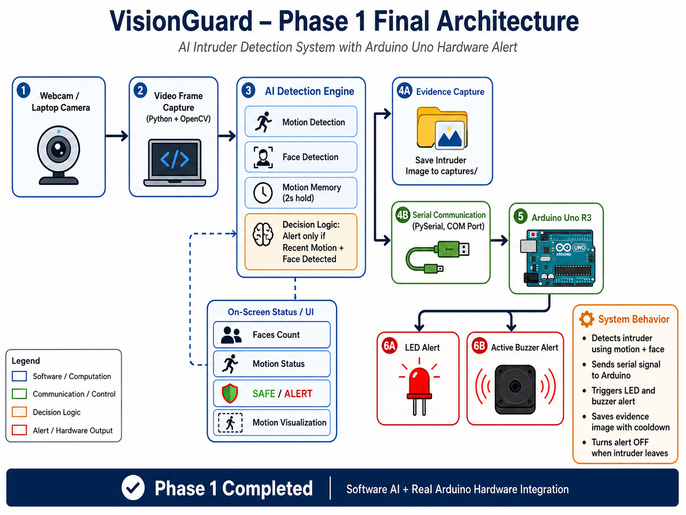
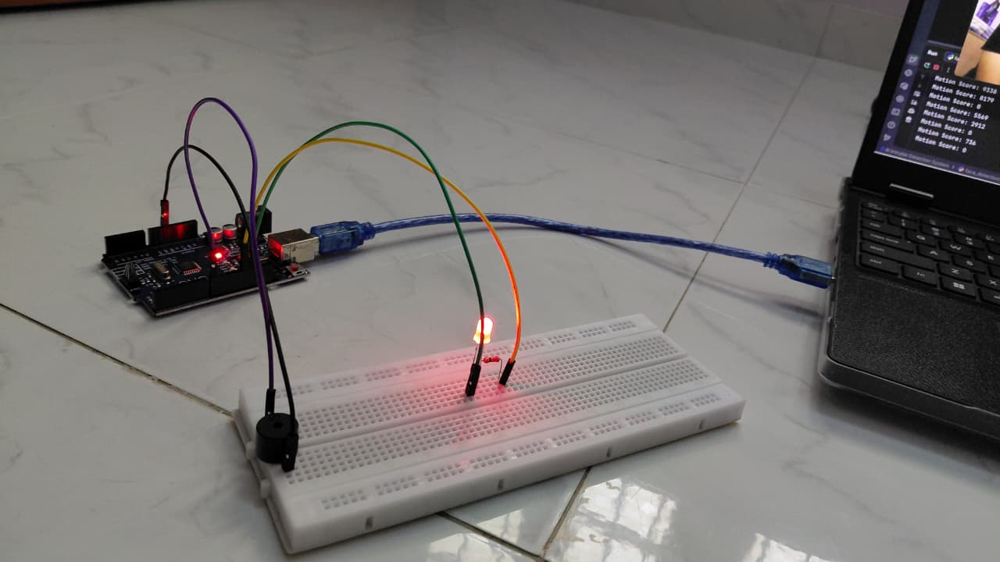
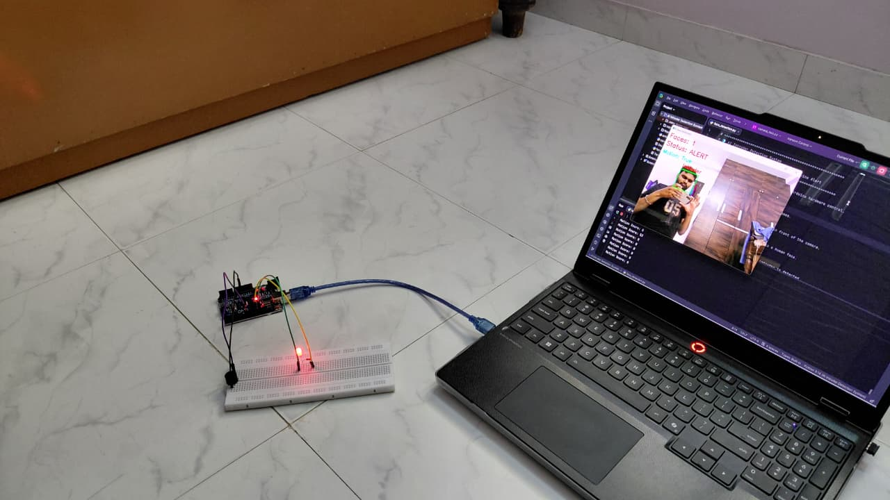

# VisionGuard – AI Intruder Detection System

VisionGuard is an AI + Embedded Systems + IoT project that detects intruders using real-time motion detection and face detection. In Phase 1, alerts were triggered using Arduino Uno. In Phase 2, the system was upgraded with ESP32, WiFi connectivity, LED and buzzer alerts, and Telegram IoT notification.

## Phase 1 Status

Phase 1 of VisionGuard has been completed successfully. The system detects motion and faces using Python and OpenCV, sends serial commands to Arduino Uno, and triggers LED and buzzer hardware alerts in real time.

Current Phase 1 capabilities:
- Real-time motion detection
- Face detection using OpenCV
- Motion memory for stable alerts
- Arduino Uno LED and buzzer control
- Evidence image capture with cooldown
- Motion visualization on video feed

## Features

- Real-time webcam monitoring
- Motion detection using frame differencing
- Face detection using OpenCV Haar Cascade
- Motion memory for stable detection
- Arduino Uno LED and buzzer alert
- Cooldown-based image capture
- Real-time status display
- Motion area visualization

## Hardware Used

- Arduino Uno R3
- LED
- 220Ω resistor
- Active buzzer
- Breadboard
- Jumper wires
- Laptop webcam

## Software Used

- Python
- OpenCV
- PySerial
- Arduino IDE

## System Workflow

Camera → Motion Detection → Face Detection → Decision Logic → Python Serial Communication → Arduino Alert

## Installation

pip install -r requirements.txt

## Arduino Setup

1. Upload `arduino/command_mode.ino` to Arduino Uno.
2. Connect LED to pin 13.
3. Connect active buzzer to pin 8.
4. Select correct COM port in Arduino IDE.

## Run the Project

1. Connect Arduino Uno to laptop.
2. Close Arduino Serial Monitor.
3. Open `code/face_detection.py`.
4. Change COM port if needed:
   ```python
   arduino = serial.Serial("COM3", 9600)
5. Run
   python code/face_detection.py
6. Press q to exit.


## Output

When motion and face detection conditions are satisfied:

- LED turns ON
- Buzzer turns ON
- Intruder image is saved in the `captures/` folder
- System status changes to ALERT

## Phase 1 Architecture



## Hardware Prototype



## Working Demo




```markdown
## Future Scope

- Send captured intruder image through Telegram
- Add timestamp and location to Telegram alerts
- Add authorized vs unauthorized face recognition
- Add WiFi reconnection logic
- Add event logging file for alert history
- Improve face detection using DNN, MediaPipe, or YOLO
- Build a simple dashboard for live system status
```
