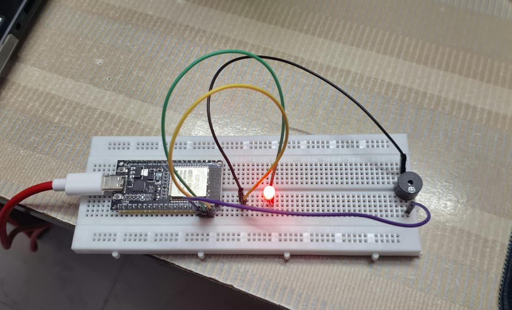
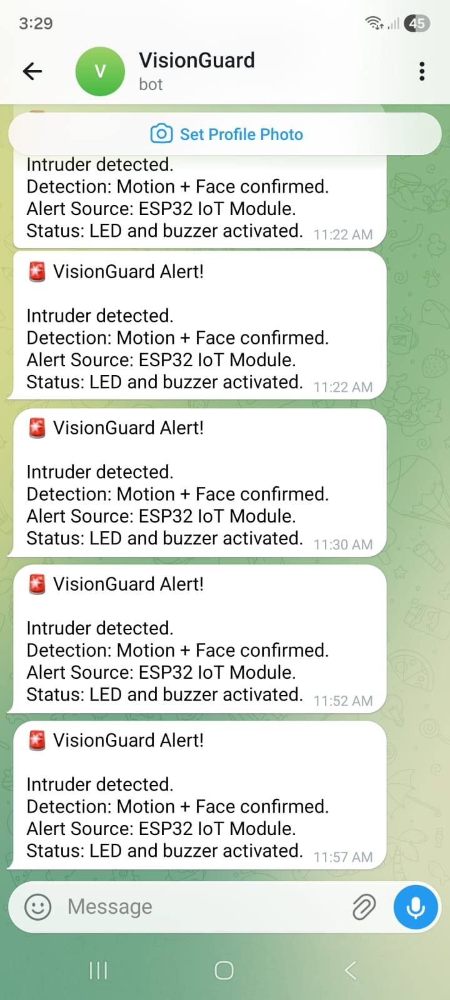
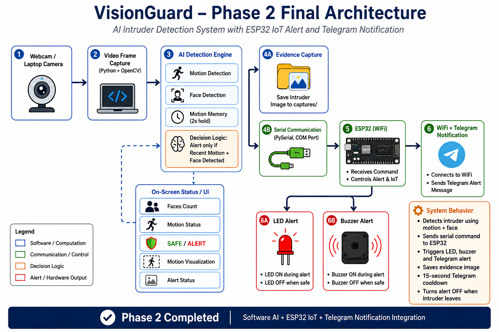

# VisionGuard Phase 2 – ESP32 IoT Alert System

## Overview

**VisionGuard Phase 2** upgrades the existing AI + Arduino intruder detection system into an **ESP32-based IoT alert system**.

In **Phase 1**, the system used Python, OpenCV, motion detection, face detection, and Arduino Uno to trigger local LED and buzzer alerts.

In **Phase 2**, the alert layer is extended using ESP32. This adds WiFi connectivity, local hardware alerts, and IoT notification capability through Telegram.

---

## Phase 2 Goal

The goal of Phase 2 is to allow the Python AI detection system to send alert signals to ESP32. After receiving the signal, the ESP32 can trigger:

- LED alert
- Buzzer alert
- WiFi-based status indication
- Telegram notification
- Future email or cloud-based notification
---

## System Flow

```text
Laptop Camera
      ↓
Python OpenCV AI Detection
      ↓
Motion + Face Decision Logic
      ↓
    ESP32
      ↓
LED + Buzzer Alert
      ↓
Telegram / Future IoT Notification
```

## Phase 1 vs Phase 2

| Feature             | Phase 1            | Phase 2                     |
| ------------------- | ------------------ | --------------------------- |
| Microcontroller     | Arduino Uno        | ESP32                       |
| Alert Type          | Local LED + Buzzer | Local + IoT Alert           |
| Connectivity        | USB Serial         | USB Serial + WiFi           |
| Remote Notification | No                 | Telegram Notification       |
| IoT Capability      | No                 | Yes                         |
| Anti-Spam Logic     | No                 | 15-second Telegram cooldown |
| Failure Handling    | Basic              | Improved                    |

## Phase - 2 Daywise 
```text
✅ Phase 1 completed
✅ Phase 2 Day 1 completed – ESP32 setup and hardware testing
✅ Phase 2 Day 2 completed – WiFi foundation and status testing
✅ Phase 2 Day 3 completed – Python AI + ESP32 serial integration
✅ Phase 2 Day 4 completed – ESP32 Telegram notification testing
✅ Phase 2 Day 5 completed – Full AI + ESP32 + Telegram integration
✅ Phase 2 Day 6 completed – Final testing, reliability, and documentation
```

## Hardware Used

- ESP32 WiFi + Bluetooth board
- External LED
- 220Ω resistor
- Active buzzer
- Breadboard
- Jumper wires
- USB cable

---

## Software Used

- Arduino IDE
- ESP32 board support package
- `WiFi.h` library
- `WiFiClientSecure.h` library
- `UniversalTelegramBot` library
- `ArduinoJson` library
- Silicon Labs USB to UART Bridge VCP driver

---

## Final Pin Configuration

| Component | ESP32 GPIO Pin |
| --------- | -------------- |
| LED       | GPIO 23        |
| Buzzer    | GPIO 22        |
| GND       | Common Ground  |


## Day 1 Summary – ESP32 Setup

On **Day 1**, the ESP32 foundation was prepared and tested.

### Completed Work

- Installed ESP32 board support in Arduino IDE
- Fixed COM port issue by installing the Silicon Labs USB to UART Bridge VCP driver
- Verified successful code upload to ESP32
- Tested external LED on GPIO 23
- Tested buzzer on GPIO 22
- Tested Serial Monitor command mode

### Key Note

The LED pin was changed from **GPIO 2** to **GPIO 23** because GPIO 2 did not work properly on this ESP32 board.

---

## ESP32 LED and Buzzer Setup



## Day 2 Summary – WiFi Foundation

On **Day 2**, ESP32 WiFi connectivity was tested.

### Completed Work

- Connected ESP32 to WiFi using the `WiFi.h` library
- Printed WiFi connection status in Serial Monitor
- Displayed ESP32 local IP address
- Used LED as WiFi connection status indicator
- Used buzzer as success/failure indicator
- Tested WiFi failure case using wrong password

### Output Behavior

| Condition | LED Output | Buzzer Output |
| --------- | ---------- | ------------- |
| Connecting to WiFi | LED blinks | OFF |
| WiFi connected successfully | LED stays ON | One beep |
| WiFi connection failed | LED stops | Three beeps |

---

## Day 3 Summary – Python AI + ESP32 Serial Integration

On **Day 3**, the Python AI detection system was integrated with ESP32 using serial communication.

The ESP32 was kept in **Serial Command Mode**, where it responds to commands received from Python through the COM port.

| Serial Command | ESP32 Output |
| -------------- | ------------ |
| `1` | LED and buzzer ON |
| `0` | LED and buzzer OFF |

### Completed Work

- Installed and tested the `pyserial` library
- Created a separate Python serial test file
- Verified that Python could control ESP32 directly
- Added ESP32 serial communication logic to the main OpenCV AI detection code
- Created a reusable `send_to_esp32()` function
- Triggered ESP32 alert only when both motion and face detection conditions were satisfied
- Completed the first full AI-to-ESP32 integration test

### Alert Logic

The ESP32 alert was triggered only when:

```text
Motion Detected + Face Detected = Intruder Confirmed
```
## Day 4 Summary – IoT Notification through Telegram

On **Day 4**, IoT notification through Telegram was prepared and tested.

### Completed Work

- Created a Telegram bot using BotFather
- Generated Telegram Bot Token
- Collected Telegram Chat ID using Telegram Bot API
- Installed required Arduino libraries:
  - `UniversalTelegramBot`
  - `ArduinoJson`
- Connected ESP32 to WiFi
- Sent first Telegram test message from ESP32
- Added LED and buzzer confirmation after message delivery
- Tested wrong WiFi password failure case
- Tested wrong bot token failure case
- Replaced sensitive credentials with placeholder values for GitHub safety

### Result

The ESP32 successfully connected to WiFi and sent a Telegram test message. The message was received on the Telegram app, confirming that ESP32-to-Telegram communication was working.

### Output Behavior

| Condition | System Response |
| --------- | --------------- |
| WiFi connecting | LED blinks |
| Telegram message sent successfully | LED blinks once and buzzer beeps once |
| WiFi or Telegram failure | Buzzer gives warning beeps |

### Security Note

Sensitive credentials such as WiFi password, Telegram Bot Token, and Chat ID were removed from GitHub-ready code and replaced with placeholders.

This completed the Telegram notification preparation stage of VisionGuard Phase 2.

---

## Day 5 Summary – Python + ESP32 + Telegram IoT Integration

On **Day 5**, full integration between Python AI detection, ESP32 hardware alerting, and Telegram IoT notification was completed.

### Completed Work

- Modified ESP32 code to receive serial commands from Python
- Programmed ESP32 to activate LED and buzzer after receiving alert command
- Programmed ESP32 to send Telegram notification after receiving alert command
- Connected Python OpenCV AI detection system with ESP32
- Tested complete AI-to-ESP32-to-Telegram flow
- Added Telegram anti-spam cooldown logic
- Protected private credentials before GitHub upload

### Working Logic

| Python Command | ESP32 Action |
| -------------- | ------------ |
| `1` | LED ON, buzzer ON, Telegram alert sent |
| `0` | LED OFF, buzzer OFF, alert state reset |

### Alert Flow

```text
Motion + Face Detected
      ↓
Python sends command '1'
      ↓
ESP32 activates LED and buzzer
      ↓
ESP32 sends Telegram alert
```
### Safe Flow
```text
Safe condition detected
      ↓
Python sends command '0'
      ↓
ESP32 turns OFF LED and buzzer
      ↓
System becomes ready for next alert
```

Cooldown Logic

During testing, repeated Telegram alerts were observed when movement continued or restarted after detection.

To solve this, a 15-second Telegram cooldown was added using:

```cpp
unsigned long lastTelegramTime = 0;
unsigned long telegramCooldown = 15000; // 15 seconds
```
This prevents Telegram spam while still allowing new alerts after the cooldown period.

Result

The full AI + ESP32 + Telegram IoT integration was completed successfully.

### Telegram Alert Received



## Day 6 Summary – Final Testing, Reliability, and Documentation

On Day 6, the complete VisionGuard Phase 2 system was re-tested, improved, cleaned, and documented.

Completed Work
Re-tested the full system pipeline
Verified the 15-second Telegram cooldown
Tested important failure cases
Improved ESP32 disconnection handling
Added camera-not-detected handling
Added first-frame camera validation
Added camera blocked / too dark detection
Added camera restored handling
Cleaned Python and ESP32 code
Added comments throughout the code
Updated README documentation
Checked GitHub safety before upload

## Phase 2 Architecture



## Current System Architecture

```text
Laptop Camera
      ↓
Python OpenCV
      ↓
Motion Detection + Face Detection
      ↓
Intruder Decision Logic
      ↓
Python Serial Command
      ↓
    ESP32
      ↓
LED + Buzzer Alert
      ↓
    WiFi
      ↓
Telegram Notification
```

## Security Note

This project uses WiFi credentials, Telegram Bot Token, and Telegram Chat ID for IoT notification testing.

For security reasons, real credentials are not uploaded to GitHub.  
Before running the code, replace the placeholder values with your own private credentials:

```cpp
const char* ssid = "YOUR_WIFI_NAME";
const char* password = "YOUR_WIFI_PASSWORD";

#define BOT_TOKEN "YOUR_BOT_TOKEN"
#define CHAT_ID "YOUR_CHAT_ID"
```
## Reliability Improvements

| Issue | Improvement Added |
| ----- | ----------------- |
| ESP32 unplugged while Python runs | Added `try-except` handling inside `send_to_esp32()` |
| Camera not detected | Added `cap.isOpened()` validation |
| First camera frame failure | Added first-frame validation |
| Camera blocked / too dark | Added brightness-based camera blocked detection |
| Camera restored after blocking | Added recovery flag and motion baseline reset |
| Telegram repeated alerts | Verified 15-second cooldown |
| GitHub credential safety | Replaced real credentials with placeholders |

---

## Camera Blocked Detection

During testing, it was observed that when the camera was physically blocked, OpenCV still received frames. In that case, the motion score became `0` because the camera was receiving a dark/static frame.

To handle this, brightness-based camera blockage detection was added:

```python
gray_check = cv2.cvtColor(frame, cv2.COLOR_BGR2GRAY)
average_brightness = cv2.mean(gray_check)[0]

camera_blocked = average_brightness < 10
```
## Future Scope

Send captured intruder image through Telegram.
Add timestamp and location to Telegram alerts.
Add WiFi reconnection logic.
Add event logging file for alert history.
Improve face detection using DNN, MediaPipe, or YOLO-based model.
Add person detection for cases where face is not clearly visible.
Build a simple dashboard for live system status.
Add mobile app or web dashboard integration.
Add cloud database logging for alert events.

## Conclusion

VisionGuard Phase 2 successfully upgrades the original AI + Arduino local alert prototype into an AI + ESP32 + Telegram IoT alert system.

The system now detects intruders using motion and face detection, sends commands from Python to ESP32 through serial communication, activates local LED and buzzer alerts, and sends Telegram notifications over WiFi.

The final system also includes cooldown-based anti-spam protection, camera blocked detection, ESP32 disconnection handling, safe shutdown logic, and GitHub-safe credential management.

This makes VisionGuard Phase 2 a complete AI, embedded systems, and IoT-based security prototype.

## Project Folder Structure

```text
VisionGuard-Phase-2-ESP32-IoT-Alert-System/
│
├── docs/
│   └── Tecnical_Report_Phase_2.docx
│
├── esp32/
│   ├── esp32_serial_telegram_alert/
│   ├── esp32_telegram_test/
│   ├── esp32_wifi_led_buzzer_status/
│   ├── esp32_wifi_telegram_alert/
│   ├── esp32_wifi_test/
│   ├── esp32_command_mode.ino
│   ├── esp32_led_blink.ino
│   └── esp32_test.ino
│
├── images/
│   └── esp32_led_and_buzzer.jpeg
│
├── README.md
├── esp32_serial_test.py
└── face_detection.py
```
